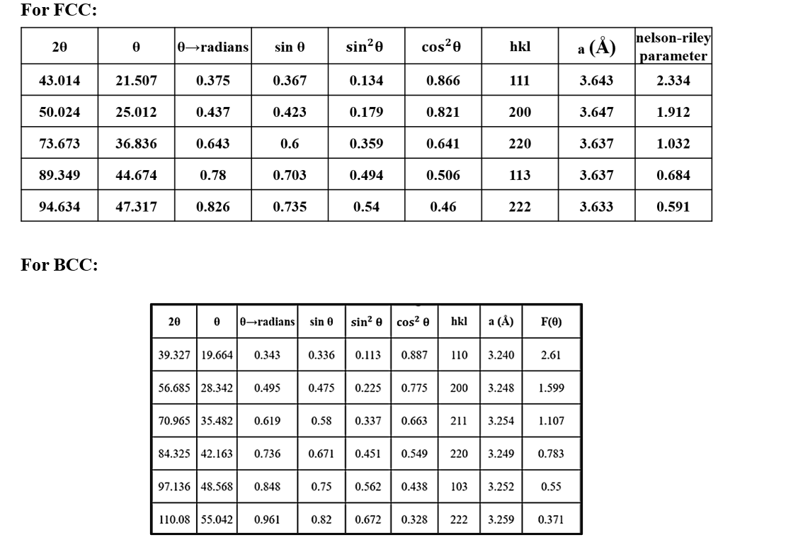
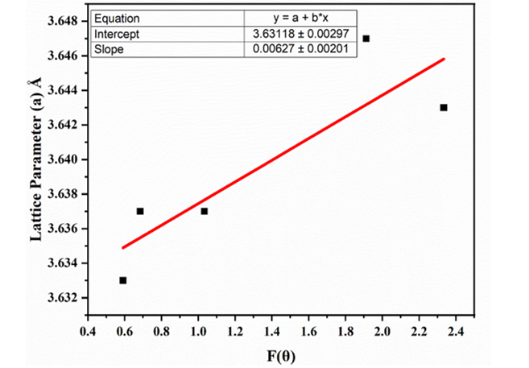
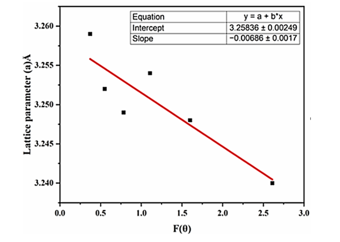

<b>Laboratory Procedure:</b>  
1. Record the diffraction peak positions (2θ) from the XRD pattern.  
2. Index the diffraction peaks by assigning the appropriate (h k l) planes corresponding to the FCC or BCC crystal structure.  
3. Calculate the Bragg angle 2θ, θ, θ (in radians), sin θ, 〖sin〗^2 θ, & 〖cos〗^2 θ, and the interplanar spacing d for each reflection using Bragg's law.  
4. Determine the lattice parameter a corresponding to each indexed reflection using the cubic lattice relationship:  
<centre>a=d√(h2+k2+l2 )</centre> 

5. Calculate the Nelson–Riley function F(θ) for each reflection and tabulate all calculated values.  

 

6.	Plot a versus F(θ) and perform linear fitting of the data obtained.  
7.	Extrapolate the best-fit line to F (θ)=0. The y-intercept of the fitted line corresponds to the precise lattice parameter of the material after minimizing systematic errors.  

<b>FCC:</b> The below procedure yields a precise lattice parameter for FCC to be 3.631±0.003 Å. 
 

<b>BCC:</b>The below procedure yields a precise lattice parameter for FCC to be 3.2583±0.003 Å. 
 

<b>Simulation Procedure: </b>   
<b>Step 1:</b> Select the preferred language (English or Hindi) from the language selection option. 

<b>Step 2:</b> Click on the <i>ON</i> button to switch on the machine. 

<b>Step 3:</b> Once the machine is turned on, click on the <i>OFF</i> button to stop the machine if required; otherwise, select the specimen. 

<b>Step 4:</b> Click on the <i>OPEN</i> button to open the chamber. 

<b>Step 5:</b> Click on the <i>CLOSE</i> button to close the chamber. 

<b>Step 6:</b> Click on the <i>STANDBY/ON</i> button and set the required voltage and current. 

<b>Step 7:</b> Set the start angle and end angle, then specify the step size and scan rate. 

<b>Step 8:</b> Click on the <i>START SCAN</i> button and observe the generated graph and observation table.

<!-- <b>Steps : </b>   

1.	From the diffractogram, we will obtain the values of all the parameters, viz., 2θ, θ, θ in radians, sin θ, sin2θ, cos2θ  
2.	Calculate the (h k l) planes for each peak using equation (1) 
3.	Calculate the corresponding values of a in each case.  
4.	Further, plot <b>F(θ) vs a</b> and perform a linear fitting of the data obtained.  
5.	The line of best fit which will be obtained will be further extrapolated to <b>F(θ) = 0</b> and the y-intercept will give us the precise lattice parameter for the particular material.  

<b>FCC</b> : The above procedure yields a precise lattice parameter for FCC to be 3.631 ± 0.003 Å.   

