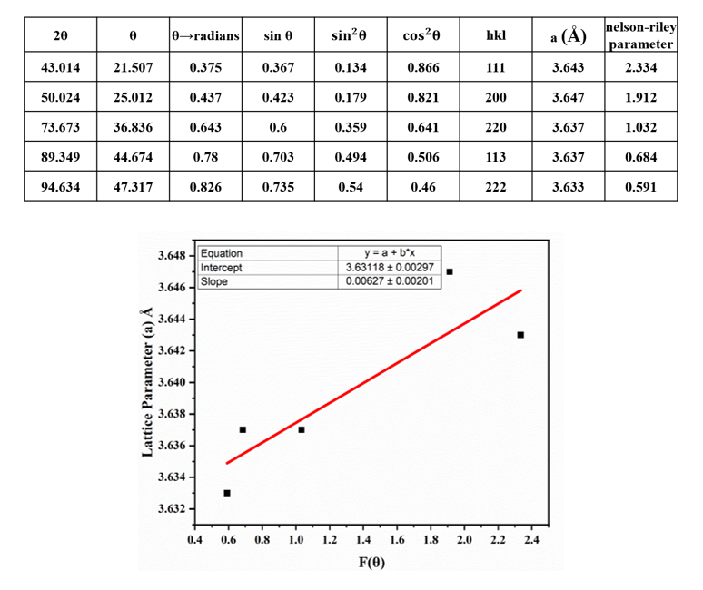

<b>Steps : </b>   

1.	From the diffractogram, we will obtain the values of all the parameters, viz., 2θ, θ, θ in radians, sin θ, sin2θ, cos2θ  
2.	Calculate the (h k l) planes for each peak using equation (1) 
3.	Calculate the corresponding values of a in each case.  
4.	Further, plot <b>F(θ) vs a<b> and perform a linear fitting of the data obtained.  
5.	The line of best fit which will be obtained will be further extrapolated to <b>F(θ) = 0</b> and the y-intercept will give us the precise lattice parameter for the particular material.  

<b>FCC</b> : The above procedure yields a precise lattice parameter for FCC to be 3.631 ± 0.003 Å.   

