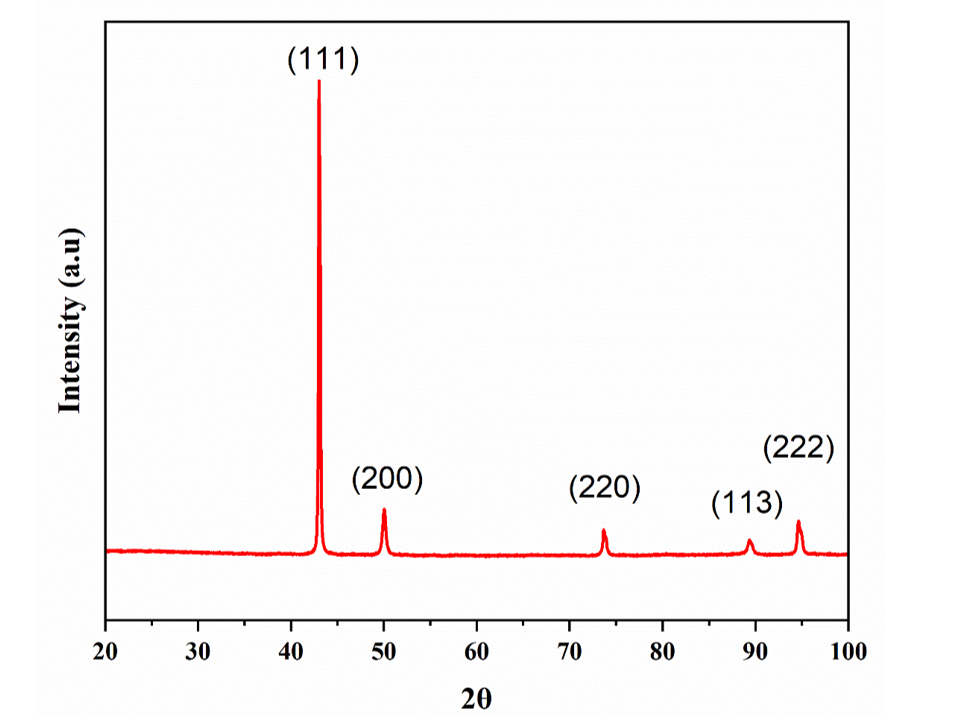
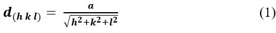
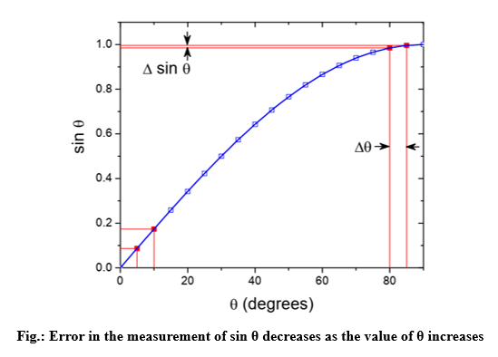
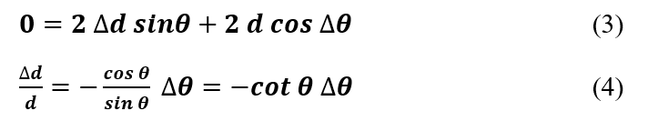
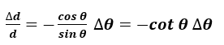
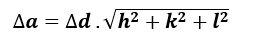
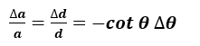

Errors in measurement of interplanar spacing d and lattice parameter(s) a using modern diffractometers can occur due to :   
-	Misalignment of the instrument 
-	Absorption of X-Rays by the specimen 
-	Displacement of the specimen from the diffractometer axis must be minimized (observational error) 
-	Vertical divergence of the incident beam 
-	Use of a flat specimen instead of a curved one to correspond to the diffractometer circle  

 
Figure 1: X-Ray Diffractogram for an FCC material  

<b>Observational error :</b>  

-	For a cubic material :  
           (1) 

Where the d-spacing is measured from Bragg’s law : <b>nλ = 2d sin⁡θ</b>		(2) 
Here, n = 1 which is the first order of diffraction and λ = 1.5406 Å for Cu-Kα radiation.  

-	Precision in measurement of a or d depends on precision in derivation of sinθ. 
 

Figure 2: Error in the measurement of sin θ decreases as the value of θ increases  

-	Take partial derivative of the Bragg equation :  
           (3) 
           (4)  

-	For a cubic system :  
           (5) 
           (6)  

-	The term ∆a⁄a  (or ∆d⁄d) is the fractional error in a (or d) caused by a given error in θ. The fractional error approaches zero as θ approaches 90°.  

-	Values of a will approach the true value as we approach 2θ = 180° (i.e., θ = 90°). We can’t measure a value at 2θ = 180°. We must plot measured values and extrapolate to 2θ = 180° versus some function of θ.  

<b>Absorption Error :  

-	For a cubic crystal with a lattice parameter a, a Nelson-Riley extrapolation function is used : 
           (7)  

