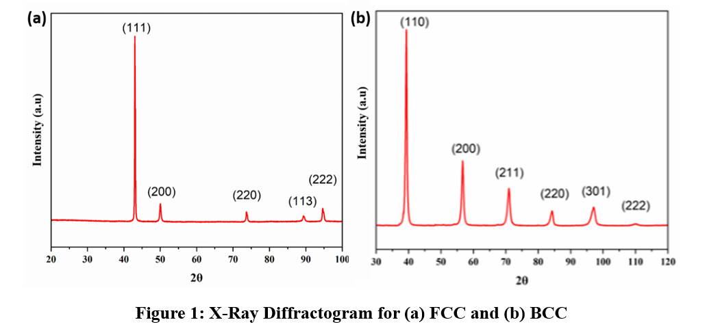
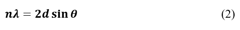
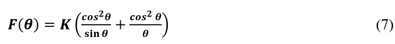
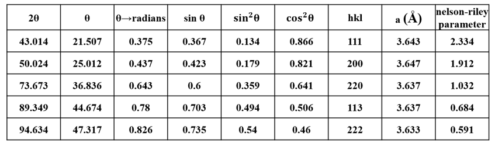
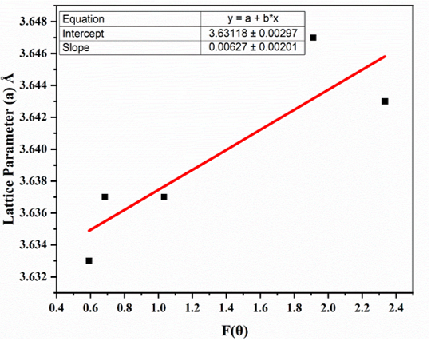

Errors in measurement of interplanar spacing <i>d</i> and lattice parameter(s) <i>a</i> using modern diffractometers can occur due to :   
-	Misalignment of the instrument 
-	Absorption of X-Rays by the specimen 
-	Displacement of the specimen from the diffractometer axis must be minimized (observational error) 
-	Vertical divergence of the incident beam 
-	Use of a flat specimen instead of a curved one to correspond to the diffractometer circle  

<!--  
Figure 1: X-Rays Diffractogram for an FCC material   -->

 

<b>Observational error :</b>  

-	For a cubic material :  
 

Where the <i>d</i>-spacing is measured from Bragg’s law :  
 
Here, n = 1 which is the first order of diffraction and λ = 1.5406 Å for Cu-Kα radiation.  

-	The precision of the calculated interplanar spacing (d) and lattice parameter (a) depends on the accuracy with which the diffraction angle θ is measured, since d is obtained through Bragg's law.. 
 

Figure 2: Error in the measurement of sin θ decreases as the value of θ increases  

-	Take partial derivative of the Bragg equation :   
  

-	For a cubic system :   
  

-	As θ reaches 90°, the fractional error (Δa/a) tends towards zero because cot θ approaches zero. Consequently, lattice parameters calculated from high-angle reflections are expected to be closer to the true lattice parameter.  

Apart from the reduction in angular measurement error at higher diffraction angles, another important factor contributing to accurate lattice parameter determination is the resolution of the Cu-Kα doublet.The Cu-Kα radiation used in XRD consists of two closely spaced wavelengths, namely Kα₁ (λ=1.54056Å) and Kα₂ (=1.54439 Å). According to Bragg's law, these two wavelengths produce diffraction peaks at slightly different diffraction angles. At lower diffraction angles, the angular separation between the Kα₁ and Kα₂ peaks is very small, causing the peaks to overlap and making the precise determination of the peak position difficult.  

As the diffraction angle increases, the angular separation between the Kα₁ and Kα₂ components becomes larger and the two peaks become progressively better resolved. Since precise lattice parameter calculations are generally based on the Kα₁ peak position, improved separation of the doublet at higher angles reduces uncertainty in peak-position measurement. Consequently, high-angle reflections provide more reliable values of interplanar spacing and lattice parameter.  

Therefore, high-angle diffraction peaks are preferred for precise lattice parameter determination because:  

1.	The fractional error (Δa/a) resulting from an error in θ decreases with increasing diffraction angle, as indicated by Eq. (6).  
2.	The Kα₁ and Kα₂ components become better resolved at higher angles, enabling more accurate determination of the Kα₁ peak position.  
3.	The effect of systematic errors is minimized through extrapolation using the Nelson–Riley function.   

<b>Correction of Systematic Errors Using Nelson–Riley Extrapolation</b>  

•	The Nelson-Riley extrapolation function compensates for systematic errors such as specimen displacement, transparency effects, absorption, and residual instrumental errors. By plotting the calculated lattice parameter values against the Nelson–Riley function F(θ) and extrapolating the best-fit line to F(θ)=0 (corresponding to θ=90∘), the influence of systematic errors is minimized and the true lattice parameter can be estimated with higher accuracy.
  

•	For a cubic crystal with a lattice parameter a, a Nelson-Riley extrapolation function is used: 

  

In practice, lattice parameters calculated from different diffraction peaks often show slight variations due to systematic experimental errors. The Nelson–Riley extrapolation method reduces these variations by exploiting the fact that most systematic errors decrease with increasing diffraction angle. Therefore, extrapolation to θ=90∘ provides the most reliable estimate of the true lattice parameter.  

<b>Steps:</b> 

1. Obtain the values of 2θ, θ, θ (in radians), sin θ, sin2 θ, & cos2 θ from the diffractogram.  
2. Index the diffraction peaks by assigning the appropriate (hkl) planes.  
3. Calculate the corresponding d-spacings using Bragg's law.  
4. Determine the lattice parameter a for each reflection using Eq. (1).  
5. Calculate the Nelson–Riley function F(θ) for each reflection.  
6. Plot the calculated lattice parameter a against F(θ).  
7. Extrapolate the best-fit line to F(θ)=0 to obtain the precise lattice parameter. 

<!-- -	The term ∆a⁄a  (or ∆d⁄d) is the fractional error in a (or d) caused by a given error in θ. The fractional error approaches zero as θ approaches 90°.  

-	Values of a will approach the true value as we approach 2θ = 180° (i.e., θ = 90°). We can’t measure a value at 2θ = 180°. We must plot measured values and extrapolate to 2θ = 180° versus some function of θ.  

<b>Absorption Error : </b>  

-	For a cubic crystal with a lattice parameter a, a Nelson-Riley extrapolation function is used : 
  

<b>Steps:</b> 

1.	From the diffractogram, we will obtain the values of all the parameters, viz., 2θ, θ, θ in radians, sin θ, sin2θ, cos2 θ  
2.	Calculate the (h k l) planes for each peak using equation (1) 
3.	Calculate the corresponding values of a in each case 

<b>Procedure of the experiment: </b> 
• For F(θ) vs a and perform a linear fitting of the data obtained.  
• The line of best fit which will be obtained will be further extrapolated to F(θ) = 0 and the y-intercept will give us the precise lattice parameter for the particular material. 

<b>FCC:</b> The above procedure yields a precise lattice parameter for FCC to be 3.631±0.003 Å. 
  
  

 -->
